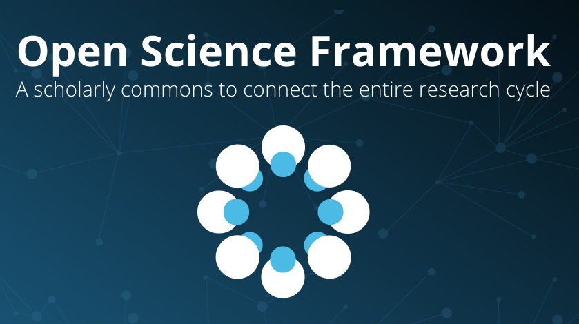
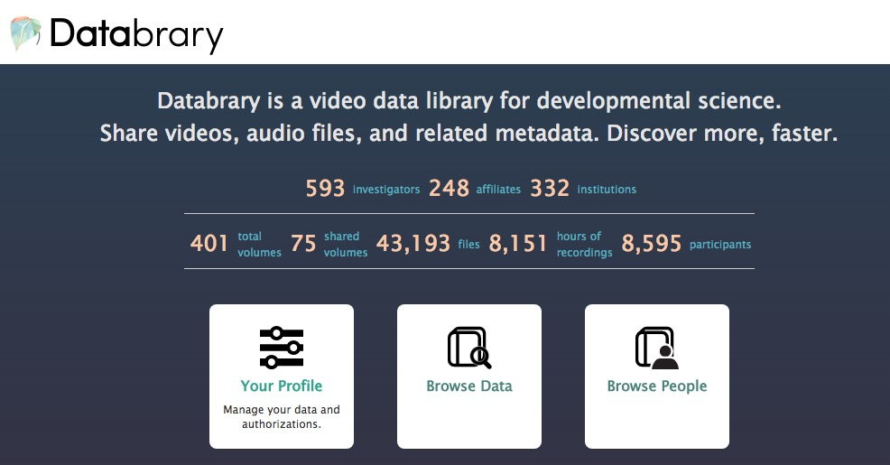

```{r setup, include=FALSE}
knitr::opts_chunk$set(echo = FALSE)
```

---

<div class="centered">
<a href="">

</a>
</div>

<div class="notes">
How many of you think psychologists need to overcome physics envy?
</div>

<!-- ## Beyond physics envy -->

<!-- <div class="centered"> -->
<!--  -->
<!-- </div> -->

## Psychology is harder than physics

<div class="notes">
Well, you don't because psychology is harder than physics.
</div>

---

<div class="centered">

</div>

<div class="notes">
Physicists are rightly proud that they can predict precisely what will happen if we put a mass on an inclined plane in a gravitational field.
</div>

---

<div class="centered">

</div>

<div class="notes">
But if we change the mass to a mouse, what happens?
Our predictions go out the window. Why?
Because there are too many variables...
Psychology is orders of magnitude harder than physics.
</div>

---

<div class="centered">

</div>

<div class="notes">
Now we should be envious of physicists' big toys like the Hubble Space telescope.
</div>

---

<div class="centered">
<a href="https://en.wikipedia.org/wiki/Hubble_Ultra-Deep_Field">

</a>
</div>

<div class="notes">
The Hubble allows us to look back into the history of our universe, some ~13 billion years ago.
</div>

## What would a data observatory for human behavior look like?

<div class="notes">
What would a similar observational instrument for peering deep into human behavior look like? I think that we have some idea already.
</div>

## Combine data from diverse domains

<div class="centered">
<a href="http://www.thehumanproject.org">

</a>
</div>

## Link measures across people

<div class="centered">
<a href="http://www.openhumans.org">

</a>
</div>

## Enable web-based data visualization, analysis

<div class="centered">
<video width="720" height="450" controls>
  <source src="mov/neurosynth-happy.mp4" type="video/mp4">
Your browser does not support the video tag.
</video>
</div>

---

<div class="centered">
<a href="http://www.socialexplorer.com/">
<div class="centered">

</div>
</a>
</div>

---

<div class="centered">
<video width="720" height="450" controls>
  <source src="mov/wordbank-vocabulary.mp4" type="video/mp4">
Your browser does not support the video tag.
</video>
</div>

## Support search, filtering by personal characteristics

<div class="centered">
<a href="http://ndar.nih.gov">

</a>
</div>

## Encourage self/active curation of data, materials

<div class="centered">

</div>

## Provide consistent, clear sharing permissions structure

<div class="centered">

</div>

## Progress

| Example | Multi-measure | Indiv link/search | Visualize | Self-curate | Permissions |
|---------|---------------|------------|-----------|-------|----|
| Databrary   | &#x2714; | &#x2714; | tabular | &#x2714; |&#x2714; |
| Human Proj  | &#x2714; | &#x2714; | ? | ? | &#x2714; |
| ICPSR       | &#x2714; | ? | &#x2714; | ? | &#x2714; |
| Neurosynth  | fMRI BOLD | group data | &#x2714; | public | NA |
| OpenNeuro   | &#x2714; |   ?       | &#x2714; | &#x2714; | public |
| Open Humans | &#x2714; | &#x2714; | ? | ? |  &#x2714; |
| OSF         | &#x2714; |          | | &#x2714; | public |
| WordBank    | M-CDI | group metadata | &#x2714; | ? | public |

## Barriers

<div class="centered">

</div>

---

<div class="centered">

</div>

<div class="notes">
As a result our work, results, and methods are siloed.
</div>

---

<div class="centered">

</div>

<div class="notes">
And it often seems like we are the proverbial blind men examining the elephant.
</div>

---

<div class="centered">

</div>

<div class="notes">
We're often like like Gollum, obsessed with possessing our "precious" methods or results.
</div>

## Metadata as "mortar"

<div class="centered">

</div>

<div class="notes">
And on a more mundane level, we could choose and adopt common metadata items and formats that would allow us to link findings across studies. But we haven't yet.
</div>

## Let's build a Databservatory for human behavior

<div class="centered">

</div>

## It should...

- Link data across studies, measures
- Link across group characteristics, individuals
- Enable searching & filtering by individual characteristics, tasks
- Support web-based data analysis, visualization; open API
- Implement a consistent framework for ethical data sharing
- Enable data aggregation, cloning, provenance tracking
- Support self/active curation
- Link to publications
- ...

---

<div class="centered">


@rogilmore</br>
[gilmore-lab.github.io/sips-2017-databservatory](http://gilmore-lab.github.io/sips-2017-databservatory)
</div>

## Acknowledgments


</br>


<div class="notes">
</div>

## Stack

This talk was produced on `r Sys.Date()` in [RStudio 1.0.143](http://rstudio.com) using R Markdown and the reveal.JS framework.
The code and materials used to generate the slides may be found at <https://github.com/gilmore-lab/sips-2017-databservatory/>. 
Information about the R Session that produced the code is as follows:

---

```{r session-info}
sessionInfo()
```

