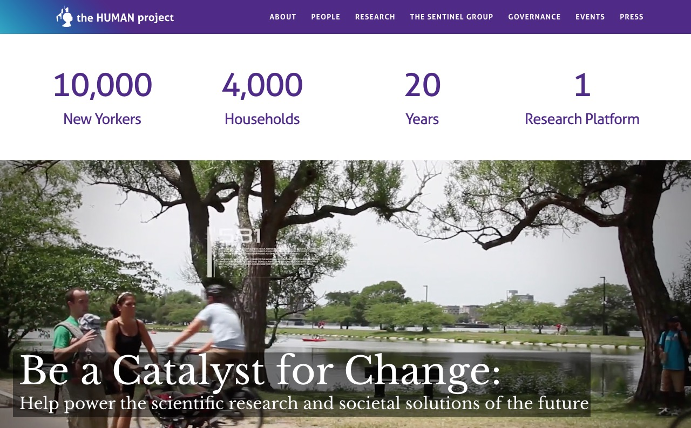
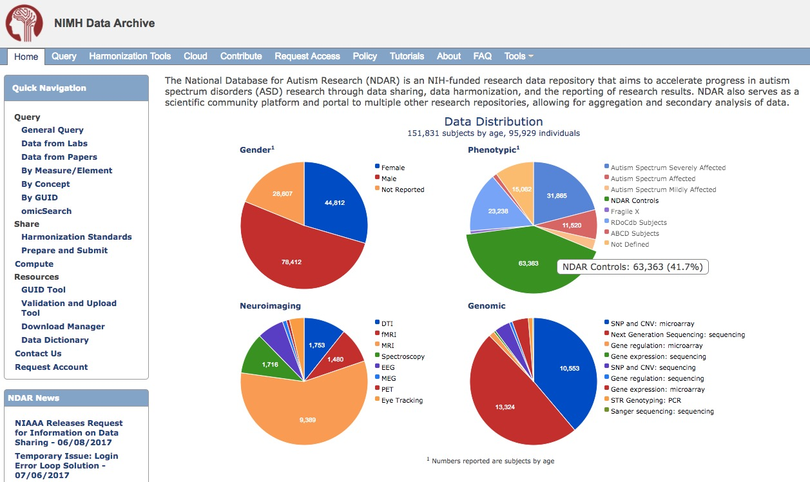

```{r setup, include=FALSE}
knitr::opts_chunk$set(echo = FALSE)
```

---

<div class="centered">
<a href="">

</a>
</div>

<!-- ## Beyond physics envy -->

<!-- <div class="centered"> -->
<!--  -->
<!-- </div> -->

## Psychology is harder than physics

---

<div class="centered">

</div>

---

<div class="centered">

</div>

---

<div class="centered">

</div>

---

<div class="centered">
<a href="https://en.wikipedia.org/wiki/Hubble_Ultra-Deep_Field">

</a>
</div>

<div class="notes">
The Hubble Ultra Deep Field. Taken over 3.5 months in 2003-04. Contains an estimated 10,000 galaxies, and because time and space collapse at astronomical distances, looks back ~13 billion years, or 400-800m years after the big bang.
</div>


## What would a data observatory for human behavior look like?

---

<div class="centered">
<a href="http://www.thehumanproject.org">

</a>
</div>

<!-- <https://www.nytimes.com/2017/06/04/nyregion/human-project-new-york-city-study.html> -->

## Open Humans

<div class="centered">
<a href="http://www.openhumans.org">

</a>
</div>

## [Neurosynth.org](http://neurosynth.org)

<div class="centered">
<video width="720" height="450" controls>
  <source src="mov/neurosynth-happy.mp4" type="video/mp4">
Your browser does not support the video tag.
</video>
</div>

## [Social Data Explorer](http://www.socialexplorer.com/)

<div class="centered">
<a href="http://www.socialexplorer.com/">
<div class="centered">

</div>
</a>
</div>

## [WordBank](http://wordbank.stanford.edu)

<div class="centered">
<video width="720" height="450" controls>
  <source src="mov/wordbank-vocabulary.mp4" type="video/mp4">
Your browser does not support the video tag.
</video>
</div>

## [National Database for Autism Research (NDAR)](https://ndar.nih.gov)

<div class="centered">
<a href="http://ndar.nih.gov">

</a>
</div>

## [Databrary.org](http://databrary.org)

<div class="centered">
<video width="720" height="450" controls>
  <source src="mov/databrary-vol-8-nih-incl-rpt.mp4" type="video/mp4">
Your browser does not support the video tag.
</video>
</div>

## Barriers

<div class="centered">

</div>

<!-- --- -->

<!-- <div class="centered"> -->
<!--  -->
<!-- </div> -->

---

<div class="centered">

</div>

---

<div class="centered">

</div>

---

<div class="centered">

</div>

---

<div class="centered">

</div>

## Let's build a Databservatory for human behavior

---

<div class="centered">

</div>

## Acknowledgments


<div class="notes">
</div>

## Stack

This talk was produced on `r Sys.Date()` in [RStudio 1.0.143](http://rstudio.com) using R Markdown and the reveal.JS framework.
The code and materials used to generate the slides may be found at <https://github.com/gilmore-lab/sips-2017-databservatory/>. 
Information about the R Session that produced the code is as follows:

---

```{r session-info}
sessionInfo()
```

